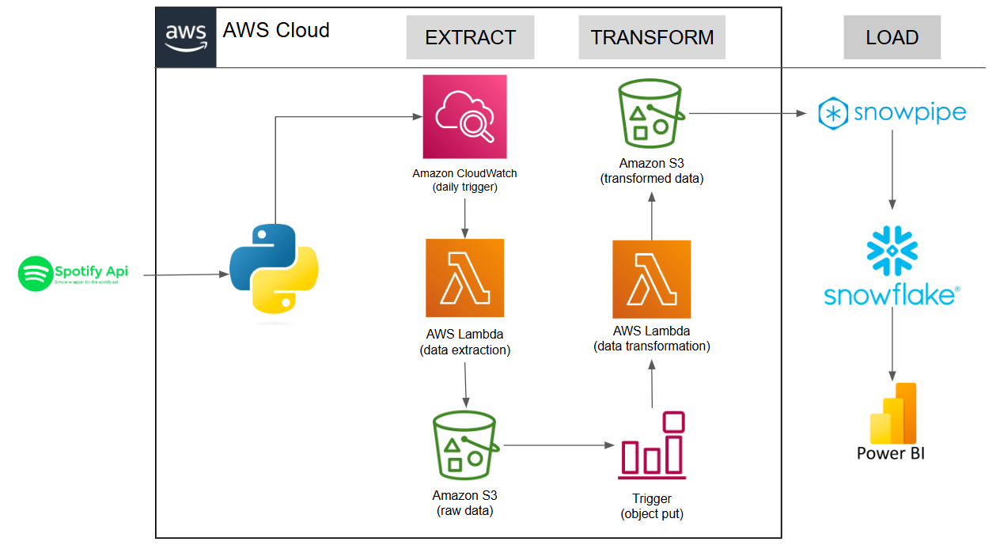

#  🎵 Spotify Data Pipeline using Python, AWS & Snowflake

## Présentation
Ce projet consiste à mettre en place un pipeline ETL combinant Spotify API, AWS et Snowflake.
Le pipeline extrait des données musicales (albums, artistes et morceaux) via l’API Spotify, les transforme à l’aide d’AWS Lambda, puis les stocke dans Amazon S3. Enfin, les données transformées sont automatiquement chargées dans Snowflake pour permettre l’analyse. 

## Architecture

Spotify API → AWS Lambda (Extraction des données) → Amazon S3 (Données brutes) ↑ CloudWatch (Déclencheur quotidien)

Amazon S3 (Données brutes) → AWS Lambda (Transformation des données) → Amazon S3 (Données transformées) ↑ Déclencheur S3 (Ajout d’objet)

Amazon S3 (Données transformées) → Snowpipe → Snowflake (Chargement automatique dans les tables) → Power BI (Visualisation & reporting)

## Composants clés

### Data Extraction
- **Spotify API : ** Utilisée pour récupérer des données musicales : morceaux, artistes et albums.
- **Authentification : ** Intégration du protocole OAuth 2.0 pour sécuriser l’accès aux endpoints de l’API.
- **Planification : ** Un job CloudWatch lance la fonction Lambda tous les jours pour aller chercher les nouvelles données.
  
### Data Transformation
- **Nettoyage : ** Traitement des valeurs manquantes, doublons, et incohérences dans les données brutes.
- **Structuration : ** Formatage des données en JSON ou CSV pour les rendre exploitables par les outils d’analyse.
- **Enrichissement : ** Ajout d’attributs supplémentaires ou agrégation de données pour enrichir les analyses.

### Data Loading
- **Amazon S3 : ** Toutes les données (brutes & transformées) sont stockées ici.
- **Snowpipe : ** Permet l’ingestion automatique des fichiers transformés vers les tables Snowflake (Album, Artist, Songs) dès qu’ils sont déposés dans S3.

## Déroulement du pipeline
1. **Extraction : ** Une fonction AWS Lambda est déclenchée quotidiennement par CloudWatch pour extraire les données Spotify. Les fichiers bruts sont enregistrés dans un bucket S3.

2. **Transformation : ** Lorsqu’un nouveau fichier est ajouté dans S3, une seconde fonction Lambda se déclenche automatiquement. Elle nettoie et transforme les données, puis les dépose dans un autre répertoire S3.

3. **Chargement : ** Snowpipe détecte automatiquement les fichiers transformés et les insère dans les tables Snowflake.

4. **Analyse SQL : ** Des scripts SQL sont utilisés pour explorer et analyser les données dans Snowflake.

## Stack techniques

### Langage de programmation :
- **Python** pour les appels API et la logique ETL

### Services AWS :
- **AWS Lambda : ** pour automatiser l’extraction et la transformation
- **Amazon CloudWatch : ** pour le déclenchement programmé
- **Amazon S3 : ** pour le stockage des données
  
### Data Warehouse
- **Snowflake : ** entrepôt de données centralisé avec ingestion automatique via Snowpipe

### Librairies :
- `spotipy` pour interagir avec l’API Spotify, 
- `pandas` pour la manipulation des données,
- `boto3` pour accéder aux services AWS.

## Avantages
- **Automatisation : ** L’ensemble du pipeline est automatisé, réduisant les efforts manuels et garantissant des données toujours à jour.
- **Scalabilité : ** L’association d’AWS et Snowflake permet de gérer efficacement des volumes de données importants.
- **Flexibilité : ** L’architecture modulaire facilite l’ajout de nouvelles sources ou d’outils d’analyse.

## Améliorations futures
- **Analyse avancée : ** Mise en place de modèles de machine learning pour prédire la popularité d’un titre ou identifier des tendances par genre musical.
- **Streaming en temps réel : ** Évolution vers une solution de streaming pour traiter les données Spotify en direct.
